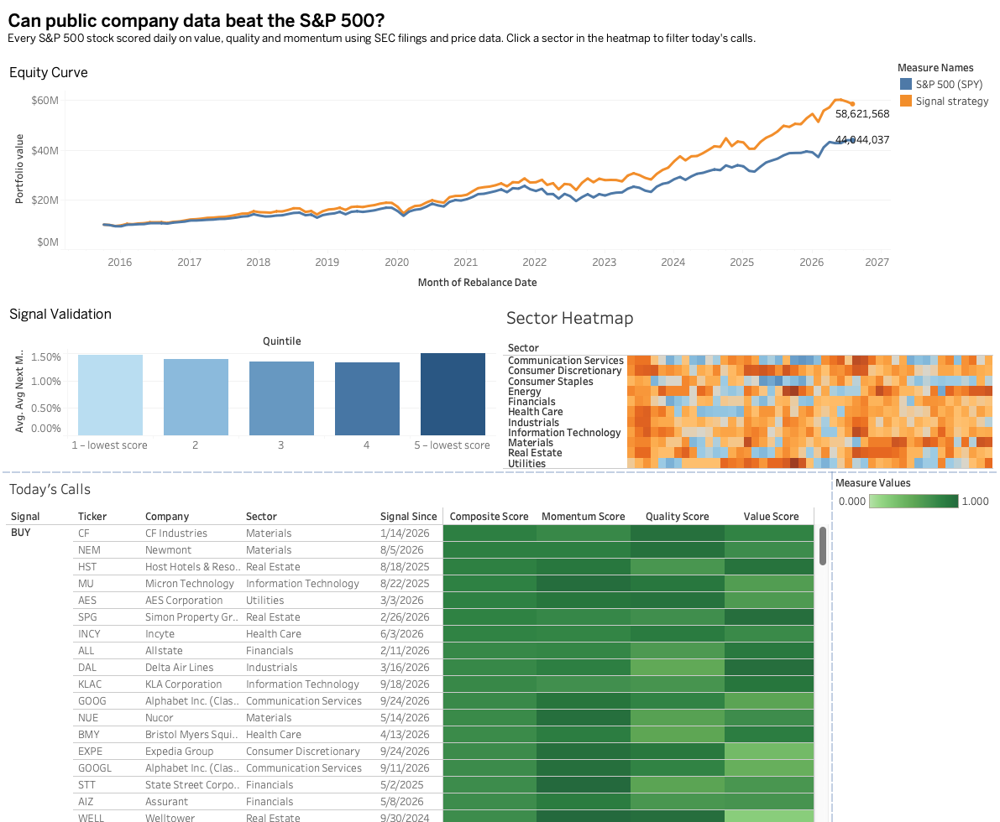
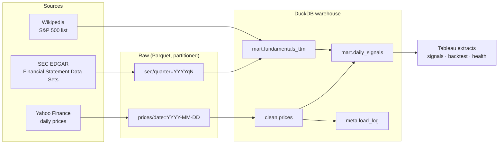

# Stock Signal Pipeline

**Can public company data tell a small investment team which S&P 500 stocks to buy or sell, and would acting on it have beaten the index?**

This project builds an end-to-end analytics pipeline that answers that question. It ingests daily stock prices and every financial statement filed with the SEC, cleans them, and scores each company on **value, quality and momentum** every trading day. It then backtests a $10M portfolio that follows those signals against simply holding the S&P 500 (SPY). Results are served to a Tableau dashboard, alongside a second dashboard that monitors the pipeline's own health.

   **[View the live dashboard on Tableau Public](https://public.tableau.com/app/profile/john.hadley1222/viz/StockSignalPipeline/SignalsPerformance?publish=yes)**

   

## Results

**Following the signals would have turned $10M into $58.6M, vs $44.0M for simply holding the S&P 500** (Oct 2015 – Aug 2026, before trading costs).

| | Signal strategy | S&P 500 (SPY) |
|---|---|---|
| Ending value of $10M | **$58.6M** | $44.0M |
| Annualized return | **17.6%** | 14.5% |
| Growth | 5.9× | 4.4× |

**The strategy:** on the last trading day of each month, buy stocks that score in the top fifth on value, quality and momentum (each ranked within its own sector) and are trading above their 200-day average. Hold each one until it falls out of the top two-fifths. All holdings are equally weighted.

**Scale:** 503 companies · 1.4M daily price rows · 155M SEC filing facts reduced to a 16K-row point-in-time table.

**Data quality:** the monitor checked all 2,951 trading days since 2015 and flagged 11, all for a stock moving more than 50% in one day. Each was reviewed and matched a real market event, not a data error.

### How much to trust this

- **Survivorship bias (the biggest caveat).** The stock universe is *today's* S&P 500, so companies that were removed or went bankrupt are missing. That flatters the strategy, while the SPY benchmark includes them. Part of the 3.1-point annual edge is likely this bias. The fix is a point-in-time list of index members.
- **No trading costs or taxes.** Both would reduce the edge.
- **One market period.** 2015–2026 was mostly a bull market. Beating the index for 11 years is encouraging, not proof it would continue.
- **Approximate Q4 earnings.** Companies never report Q4 on its own, so Q4 is derived as full year minus Q1–Q3, which is slightly off when share counts change during the year.

## Architecture



Orchestrated with **Dagster**. Prices are partitioned **by day** and SEC filings **by quarter**. Every partition can be re-run or **backfilled** (a 10-year backfill runs as one set-based query, not 2,500 separate jobs).

## Repository layout

```
pipeline/
  assets.py          ingestion, cleaning and mart assets + data quality check
  definitions.py     jobs and schedules
  warehouse.py       paths + helper to run .sql files
sql/
  setup.sql          table definitions
  clean/             raw -> clean (parsing, dedupe)
  marts/             fundamentals_ttm, daily_signals
  analysis/          the queries behind the Tableau dashboard
  monitoring/        pipeline health query
  util/              small helper queries
```

## Data cleaning

The SEC data is genuinely messy. The price feed is made messy on purpose (`make_messy` in `assets.py`) so the clean layer has something to fix:

| Problem | Where | Fix |
|---|---|---|
| Mixed date formats (`2024-03-01`, `03/01/2024`) | prices | `TRY_STRPTIME` with a fallback format |
| Tickers like `" aapl "` | prices | `UPPER(TRIM())`, then dedupe *after* normalising |
| Prices as strings like `"$1,234.50"` | prices | `REGEXP_REPLACE` + `TRY_CAST` |
| ~2% duplicate rows | prices | `QUALIFY ROW_NUMBER()`, keeping the full-precision value |
| Restated filings (10-K/A) | SEC | keep the version **first** filed (what investors knew then) |
| Prior-year comparatives inside each filing | SEC | keep only values for the filing's own period |
| Q4 never reported on its own | SEC | Q4 = full year − (Q1 + Q2 + Q3) |
| Same concept, different tag names | SEC | `COALESCE` across revenue tags in priority order |

## Query optimisation

- **Aggregate once, query many times.** SEC `num.txt` holds every number from every company's filings (tens of millions of rows). `mart.fundamentals_ttm` reduces that to ~500 companies × ~45 quarters × 8 columns. Every downstream query reads the small table.
- **Only the columns and rows the problem needs.** Seven XBRL tags out of thousands; S&P 500 members only; price close and volume only.
- **Partition pruning.** Raw prices are stored in `date=` folders, so a one-day load opens one folder instead of ten years of files.
- **Sorted inserts.** Tables are written in date order, so DuckDB's min/max zone maps skip irrelevant row groups without needing an index.
- **Monthly analysis off month-end rows.** The backtest and validation queries read ~12 rows per stock per year instead of ~252.
- **Idempotent incremental loads.** Delete-then-insert per partition range: re-running a day never double-counts.

## SQL highlights

| Technique | Why it's needed here | File |
|---|---|---|
| `ASOF JOIN` | attach the latest filing that was *already public* on each day, preventing look-ahead bias | `marts/daily_signals.sql` |
| Window functions | 200-day average, 12-1 momentum, trailing-twelve-month sums, year-over-year growth | `marts/*.sql` |
| `PERCENT_RANK` partitioned by sector | compare banks with banks, not with software companies | `marts/daily_signals.sql` |
| Gaps-and-islands | how many days a stock has held its current BUY/SELL call | `analysis/01_todays_signals.sql` |
| **Recursive CTE** | a "hold band" trading rule where this month's position depends on last month's | `analysis/03_backtest.sql` |
| `EXP(SUM(LN(1+r)))` | compounded portfolio value as a running product | `analysis/03_backtest.sql` |

## The model

Each day, each stock gets three scores (0–1 percentile ranks within its sector):

- **Value:** earnings yield (E/P) and book-to-market
- **Quality:** return on equity and year-over-year revenue growth
- **Momentum:** 12-month return, skipping the most recent month

The composite score is split into quintiles. **BUY** = top quintile *and* trading above its 200-day average. **SELL** = bottom quintile.

## Dashboards (Tableau Public)

1. **Signals & performance:** today's BUY/SELL list with factor breakdown (`01`), whether the score predicts returns (`02`), the $10M equity curve against SPY (`03`), and a sector heatmap (`04`).
2. **Pipeline health:** a calendar of every expected trading day flagged `MISSING`, `LATE`, `LOW_VOLUME`, `HIGH_DUPES` or `CHECK_PRICES`.

Tableau Public can't connect to DuckDB, so the `tableau_extracts` asset writes each query's result to `data/exports/*.csv`.

## Running it

```bash
python -m venv .venv && source .venv/bin/activate
pip install -r requirements.txt
export SEC_USER_AGENT="Your Name your@email.com"   # required by SEC
export DAGSTER_HOME="$(pwd)/dagster_home"           # keeps run history between restarts
dagster dev                                         # opens the UI at http://localhost:3000
```

In the Dagster UI:

1. Materialise `sp500_universe` and `trading_calendar`.
2. Backfill `raw_sec_filings` for all quarters, then materialise `fundamentals_ttm`.
3. Backfill `raw_prices` → `clean_prices` → `daily_signals` from 2015-01-01. Doing it one year at a time is gentler on Yahoo's rate limits.
4. Materialise `tableau_extracts` and connect Tableau to the CSVs.

After that, the daily schedule loads each new day automatically.

## Known limitations

- **Survivorship bias:** the universe is *today's* S&P 500, so companies that were dropped or went bankrupt are missing and the backtest is flattered. A point-in-time membership list would fix this.
- No transaction costs or taxes in the backtest.
- Q4 EPS is derived by subtraction, which is approximate when share counts change during the year.
